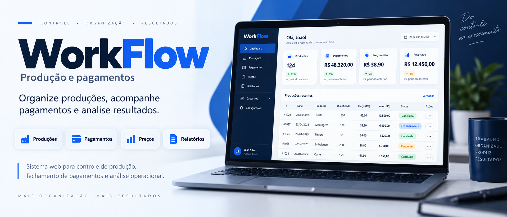

WorkFlow

Sistema web desenvolvido em Python + Flask para registrar, organizar e acompanhar produções, produtos, etapas, preços e pagamentos.

O WorkFlow nasceu para resolver um problema real de controle de produção: substituir registros manuais e cálculos repetitivos por um sistema simples capaz de armazenar o histórico de trabalho, calcular valores e facilitar o acompanhamento da produtividade e dos pagamentos.

---

>[!IMPORTANT]

⚠️ Sobre a versão deste repositório

O código disponível atualmente na branch principal deste repositório ainda corresponde à versão original que desenvolvi e posteriormente pausei.

Essa versão foi mantida no repositório como parte do histórico de desenvolvimento do projeto.

A versão mais recente e aprimorada do WorkFlow está disponível na seção Releases.

Se você deseja utilizar as funcionalidades mais novas, correções e melhorias descritas neste README, baixe a versão mais recente em:

GitHub → Releases → Latest Release

O código da versão atualizada poderá ser incorporado à branch principal futuramente.»

---

📌 Sobre o projeto

O WorkFlow é um sistema monolítico voltado para controle de produção e pagamentos.

O sistema permite registrar cada produção realizada informando dados como:

- Produto
- Etapa
- Quantidade produzida em dúzias
- Preço por dúzia
- Data
- Observação

A partir dessas informações, o WorkFlow calcula os valores correspondentes e mantém um histórico que posteriormente pode ser utilizado para criar pagamentos e gerar relatórios.

O fluxo principal do sistema é:

Produzir
   ↓
Registrar produção
   ↓
Acompanhar histórico
   ↓
Selecionar produções
   ↓
Criar pagamento
   ↓
Confirmar pagamento
   ↓
Analisar produção e resultados

---

✨ Funcionalidades

📦 Produções

Permite registrar e acompanhar as produções realizadas.

Cada produção pode possuir:

- Produto
- Etapa
- Quantidade de dúzias
- Preço por dúzia
- Valor total
- Data
- Observação
- Pagamento relacionado

O valor total da produção é calculado utilizando:

Valor total = dúzias × preço por dúzia

Recursos

- Criar produção
- Editar produção
- Excluir produção quando permitido
- Filtrar produções
- Visualizar histórico
- Selecionar produções para pagamento
- Registrar novamente uma produção anterior

⚡ Registrar novamente

A opção Registrar novamente permite reutilizar os dados de uma produção anterior para agilizar novos registros semelhantes.

Isso reduz o preenchimento repetitivo quando o mesmo produto e etapa são utilizados frequentemente.

---

📦 Produtos

O WorkFlow permite cadastrar diferentes combinações de produtos utilizadas durante a produção.

Um produto pode ser composto por características como:

- Família
- Material
- Qualidade
- Quantidade de furos
- Tipo de taco

O sistema também verifica combinações duplicadas para evitar o cadastro acidental do mesmo produto várias vezes.

Gerenciamento

Produtos podem ser:

- Criados
- Consultados
- Ativados
- Desativados

Um produto desativado não precisa ser apagado.

Dessa forma, registros históricos continuam apontando corretamente para o produto utilizado naquela produção.

---

🏭 Etapas

As produções podem ser associadas a diferentes etapas do processo produtivo.

Exemplos:

Amarração
Enchimento
Pinação
Penteação
Aparação
Encabação
Acabamentos

A estrutura permite adicionar e organizar outras etapas conforme o processo produtivo evoluir.

---

💵 Tabela de preços

O WorkFlow possui uma tabela responsável por relacionar:

Produto + Etapa → Preço por dúzia

Exemplo:

Produto: Extra 20 furos
Etapa: Amarração
Preço: R$ 2,50 / dúzia

Quando uma produção é registrada, o preço utilizado é armazenado na própria produção.

Isso significa que alterações futuras na tabela de preços não modificam os valores históricos.

Exemplo:

Janeiro
Preço: R$ 2,00

Março
Novo preço: R$ 2,50

Uma produção registrada em janeiro continua mantendo o preço original de R$ 2,00.

Verificação de preços

A versão mais recente também identifica combinações de produto e etapa que ainda não possuem preço configurado.

Isso ajuda a encontrar configurações incompletas antes de registrar novas produções.

---

💰 Pagamentos

Produções podem ser agrupadas para formar pagamentos.

O sistema calcula automaticamente:

- Quantidade total de dúzias
- Valor total
- Período correspondente
- Produções incluídas

Os pagamentos possuem estados como:

Pendente
Pago

Recursos

- Criar pagamento
- Confirmar pagamento
- Reabrir pagamento
- Excluir pagamento quando permitido
- Filtrar pagamentos por período
- Adicionar observações
- Visualizar detalhes
- Consultar todas as produções pertencentes ao pagamento

---

⚡ Fechamentos rápidos

A versão mais recente facilita a seleção das produções que devem fazer parte de um pagamento.

São disponibilizados períodos rápidos para auxiliar o fechamento, reduzindo a necessidade de selecionar manualmente grandes quantidades de registros.

O objetivo é tornar mais simples fluxos de pagamento:

Semanais
Quinzenais
Mensais
ou por períodos personalizados

---

🛡️ Proteção contra pagamentos duplicados

O backend possui validações adicionais para impedir que uma produção já vinculada a um pagamento seja adicionada novamente a outro.

A regra não depende apenas da interface.

Antes da criação do pagamento, o sistema verifica o estado das produções selecionadas.

Isso reduz o risco de inconsistências financeiras.

---

📊 Dashboard

A versão mais recente adiciona uma página inicial voltada para acompanhamento rápido do sistema.

O Dashboard utiliza os dados registrados para apresentar uma visão geral da produção e dos valores acumulados.

Entre as informações que podem ser acompanhadas estão dados relacionados a:

- Produções
- Dúzias produzidas
- Valores
- Pagamentos
- Períodos recentes
- Situação geral da produção

O objetivo é fazer o WorkFlow deixar de ser apenas um sistema de cadastro e passar também a ajudar na interpretação dos dados registrados.

---

📈 Relatórios

A versão mais recente possui relatórios mais completos.

As produções podem ser analisadas por:

Produto

Permite descobrir quais produtos representam a maior parte da produção.

Etapa

Permite analisar quanto foi produzido em cada etapa.

Dia

Permite acompanhar a evolução diária da produção.

Período

É possível delimitar datas específicas para analisar apenas um intervalo desejado.

Exemplo:

01/09/2026 → 30/09/2026

Os relatórios apresentam informações como:

Dúzias
Valor produzido
Quantidade de registros
Produtos
Etapas
Datas

---

📄 Exportação CSV

Os dados dos relatórios podem ser exportados para arquivos CSV.

Isso permite utilizar os registros do WorkFlow em ferramentas externas como:

- Microsoft Excel
- Google Sheets
- LibreOffice Calc
- Python/Pandas
- Ferramentas de análise de dados

Essa funcionalidade também fornece uma maneira simples de transportar informações para outros sistemas.

---

💾 Backup

A versão mais recente permite baixar uma cópia do banco SQLite utilizado pelo WorkFlow.

O backup preserva informações como:

Produções
Produtos
Etapas
Preços
Pagamentos
Histórico

É recomendado realizar backups periodicamente, principalmente antes de atualizações importantes no sistema.

---

🛡️ Integridade dos dados

Diversas validações são realizadas no backend para evitar registros inconsistentes.

Entre elas:

- Verificação de produtos existentes
- Verificação de etapas existentes
- Verificação de produtos ativos
- Verificação de etapas ativas
- Proteção contra produtos duplicados
- Proteção contra pagamentos duplicados
- Validação de quantidade produzida
- Validação de preços
- Tratamento de valores monetários
- Validação das produções antes de criar pagamentos

As regras importantes não ficam exclusivamente no JavaScript da interface.

O backend continua responsável pela validação final dos dados.

---

🗃️ Banco de dados

O projeto utiliza SQLite.

Essa escolha mantém o sistema simples e adequado ao objetivo atual do WorkFlow.

Não é necessário configurar um servidor externo de banco de dados para utilizar o projeto.

Exemplo:

instance/
└── dev.db

O banco mantém os relacionamentos entre entidades como:

Product
Production
Stage
Price
Payment
Material
Quality
Hole
StickType
ProductFamily

---

🏗️ Arquitetura

O WorkFlow utiliza uma arquitetura modular baseada em domínios.

Estrutura simplificada:

app/
│
├── production/
│   ├── views.py
│   ├── services/
│   ├── repositories/
│   ├── dtos/
│   └── models/
│
├── payment/
│   ├── views.py
│   ├── services/
│   ├── repositories/
│   └── models/
│
├── product/
│
├── price/
│
├── report/
│
└── shared/

O objetivo é manter responsabilidades separadas sem transformar o projeto em uma arquitetura desnecessariamente complexa.

O fluxo normalmente segue:

View
  ↓
DTO / validação
  ↓
Service
  ↓
Repository
  ↓
SQLAlchemy
  ↓
SQLite

---

🧰 Tecnologias

Principais tecnologias utilizadas:

Python
Flask
SQLAlchemy
SQLite
HTML
CSS
JavaScript
jQuery

---

🚀 Executando o projeto

Clone o repositório:

git clone <URL_DO_REPOSITORIO>

Entre no diretório:

cd WorkFlow

Crie um ambiente virtual:

python -m venv .venv

Linux / Termux

source .venv/bin/activate

Windows

.venv\Scripts\activate

Instale as dependências:

pip install -r requirements.txt

Execute a aplicação conforme o entrypoint presente na versão utilizada.

---

📥 Qual versão devo baixar?

Existem atualmente duas situações diferentes.

Código da branch principal

Representa a versão do WorkFlow que foi desenvolvida originalmente antes da pausa no desenvolvimento.

Ela permanece disponível para preservar o estado e o histórico daquela fase do projeto.

Releases

Os Releases contêm as versões mais recentes e aprimoradas do WorkFlow.

Se você deseja testar ou utilizar as funcionalidades descritas nas seções mais recentes deste README, utilize:

GitHub
   ↓
Releases
   ↓
Latest Release
   ↓
Download

«Para obter atualmente a versão mais completa do WorkFlow, utilize o arquivo disponibilizado no Release mais recente.»

---

🗺️ Direção do projeto

O objetivo do WorkFlow não é se transformar em um ERP genérico.

A prioridade é resolver bem o fluxo para o qual foi criado:

Produção
    ↓
Registro
    ↓
Organização
    ↓
Pagamento
    ↓
Relatórios
    ↓
Análise

Novas funcionalidades devem continuar seguindo três princípios:

1. Resolver um problema real do processo produtivo.
2. Reduzir trabalho manual.
3. Evitar complexidade sem benefício prático.

---

📌 Estado atual

O projeto passou por uma pausa após sua primeira fase de desenvolvimento.

Posteriormente, uma versão aprimorada foi criada adicionando novas funcionalidades de produtividade, pagamentos, relatórios, segurança e análise.

Por enquanto:

Branch principal → versão original antes da pausa

Releases → versões mais recentes e aprimoradas

Consulte sempre a seção Releases para verificar a versão mais atual disponível.

---

📜 Licença

Consulte o arquivo de licença do repositório para conhecer as condições de uso, modificação e distribuição do projeto.

---

WorkFlow

Registrar. Organizar. Acompanhar. Analisar.
